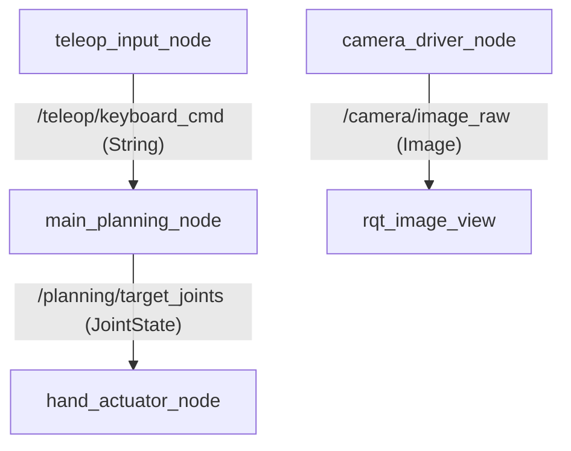

# 다관절 로봇 손 제어 프레임워크 (ROS 2 Humble / Jazzy)

본 프로젝트는 실제 하드웨어 장비 없이 가상 환경에서 다관절 로봇 손의 노드 간 통신 무결성 및 관절 제어 파이프라인을 검증하기 위한 ROS 2 Humble 및 Jazzy 기반 시뮬레이션 프레임워크입니다.

---

## 1. 전체 코드 아키텍처 및 노드 리뷰

본 프레임워크는 총 4개의 ROS 2 Python 노드로 구성되어 통신 무결성을 모방/검증합니다.



### 1) 사용자 키보드 명령 발행부 (`teleop_input_node`)
- **역할**: 터미널 환경에서 사용자의 단축키 입력(`q`, `w`, `e`, `r`, `s`)을 대기하고 비선점형(Non-blocking) 방식으로 키보드를 읽습니다.
- **통신**: 감지된 단축키 값을 문자열 타입 데이터로 `/teleop/keyboard_cmd` 토픽에 발행합니다.
- **코드 특징**: Linux 환경(`termios`, `tty` 이용)과 Windows 환경(`msvcrt` 이용)을 모두 지원하도록 작성되었습니다.

### 2) 메인 플래너 및 경로 계산부 (`main_planning_node`)
- **역할**: 동작 제어 커맨드 수신 시 15개 관절에 대한 각도 연산을 수행합니다.
- **동작 테이블**:
  - `q` (Open Hand): 15개 전체 관절 각도 0.0 rad 초기화.
  - `w` (Close Hand): 주먹 쥐기 모방 (모든 관절 1.57 rad).
  - `e` (Pinch): 엄지와 검지 꼬집기 (1~4번 관절 1.0 rad, 나머지 0.0 rad).
  - `r` (Point): 검지만 펴기 (3, 4번 관절만 0.0 rad, 나머지 1.57 rad).
  - `s` (Stop / Reset): 긴급 리셋 (모든 관절 0.0 rad).
- **통신**: 연산된 관절 목표값을 `/planning/target_joints` (`sensor_msgs/JointState`) 토픽에 실시간 시간 정보를 스탬프로 담아 발행합니다.

### 3) 가상 구동/액추에이터 모방부 (`hand_actuator_node`)
- **역할**: 플래너가 계산하여 보낸 타겟 관절 각도를 구독합니다.
- **통신**: `/planning/target_joints` 토픽을 실시간으로 감지하고 있으며, 유입된 메시지의 관절 개수와 각 관절별 목표 각도(Radian)값을 수신하여 로그 창에 실시간 출력하여 정상 통신을 입증합니다.

### 4) 가상 카메라 드라이버 (`camera_driver_node`)
- **역할**: OpenCV 이미지와 `cv_bridge` 모듈을 이용하여 가상의 영상 프레임을 생성하고 10Hz의 주기로 브로드캐스팅합니다.
- **통신**: `/camera/image_raw` (`sensor_msgs/Image`) 토픽으로 검은 배경화면에 "Camera is running..." 텍스트를 담은 영상 메시지를 발행합니다.

---

## 2. 빌드 및 실행 방법

### 요구 사항
- **OS**: Ubuntu 24.04 LTS (권장) 또는 Ubuntu 22.04 LTS
- **ROS 버전**: 
  - Ubuntu 24.04: **ROS 2 Jazzy Jalisco**
  - Ubuntu 22.04: **ROS 2 Humble Hawksbill**
- **도구**: Python 3, `colcon` 빌드 시스템, `cv_bridge` 모듈

### 빌드 및 실행 순서
1. ROS 2 워크스페이스 디렉토리로 이동 후 빌드합니다.
   ```bash
   cd ros2_ws
   colcon build --symlink-install
   ```
2. **[터미널 1]** ROS 2 전역 환경변수 및 워크스페이스 환경 변수를 불러오고 ROS 2 런처 실행 (카메라, 플래너, 가상 구동부 동시 구동):
   - **Ubuntu 24.04 (Jazzy)**:
     ```bash
     source /opt/ros/jazzy/setup.bash
     source install/setup.bash
     ros2 launch dexterous_hand_core dexterous_hand.launch.py
     ```
   - **Ubuntu 22.04 (Humble)**:
     ```bash
     source /opt/ros/humble/setup.bash
     source install/setup.bash
     ros2 launch dexterous_hand_core dexterous_hand.launch.py
     ```
3. **[터미널 2]** ROS 2 키보드 제어 노드 실행:
   - **Ubuntu 24.04 (Jazzy)**:
     ```bash
     source /opt/ros/jazzy/setup.bash
     source install/setup.bash
     ros2 run dexterous_hand_core teleop_input_node
     ```
   - **Ubuntu 22.04 (Humble)**:
     ```bash
     source /opt/ros/humble/setup.bash
     source install/setup.bash
     ros2 run dexterous_hand_core teleop_input_node
     ```
4. **[터미널 3] (선택 사항)** ROS 2 이미지 뷰어 실행:
   ```bash
   ros2 run rqt_image_view rqt_image_view
   ```
   > 가상 카메라 드라이버가 발행하는 이미지 `/camera/image_raw`를 선택하여 관찰합니다.

---

## 3. 제어 단축키 가이드
`teleop_input_node`가 구동되는 터미널 창을 선택(포커싱)한 상태에서 입력해야 통신망에 명령이 전파됩니다.

| 키 | 동작명 | 상세 제어 상태 |
| :---: | :--- | :--- |
| **q** | **Open Hand** | 15개 손가락 관절 각도 0도(완전히 편 상태) |
| **w** | **Close Hand** | 15개 전체 관절 1.57rad 구부림(주먹 상태) |
| **e** | **Pinch** | 1~4번(엄지/검지) 관절 1.0rad 굽힘, 나머지 0.0rad(꼬집기) |
| **r** | **Point** | 검지(3번) 및 기타 일부 관절만 피고 나머지 주먹(가리키기) |
| **s** | **Stop / Reset** | 모든 제어 신호 초기화 및 리셋 |
| **CTRL-C** | **Quit** | 프로그램 종료 |
